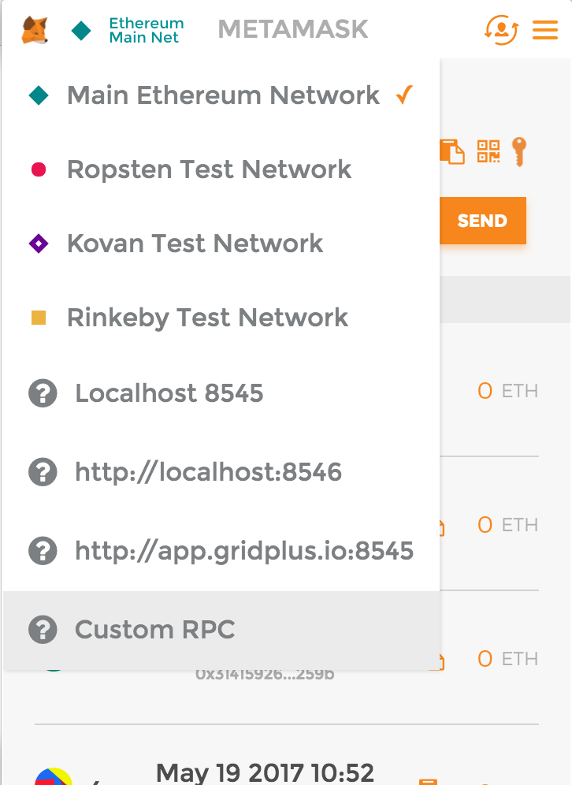
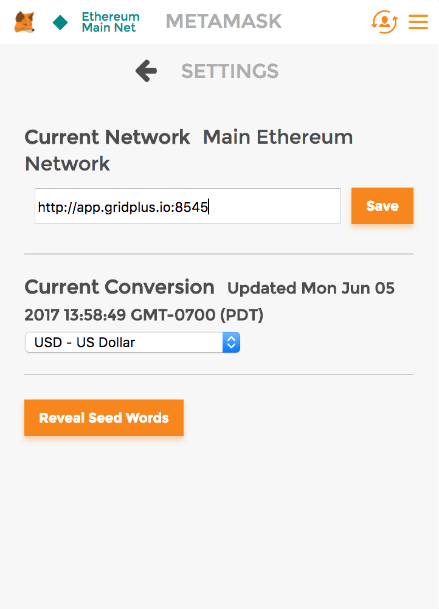
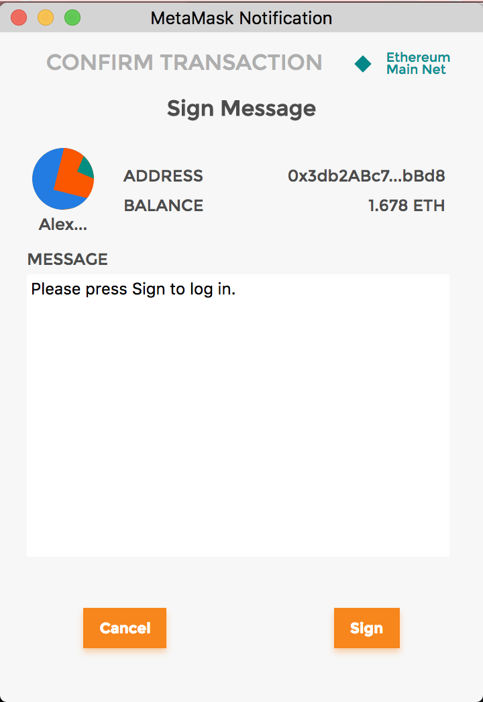
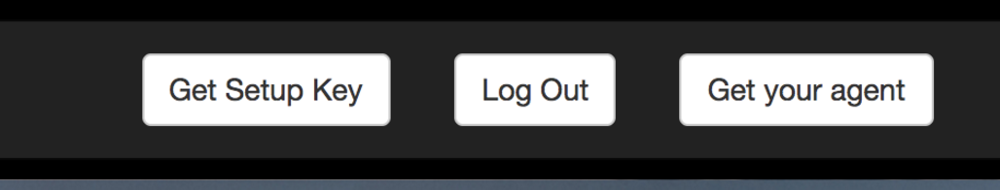
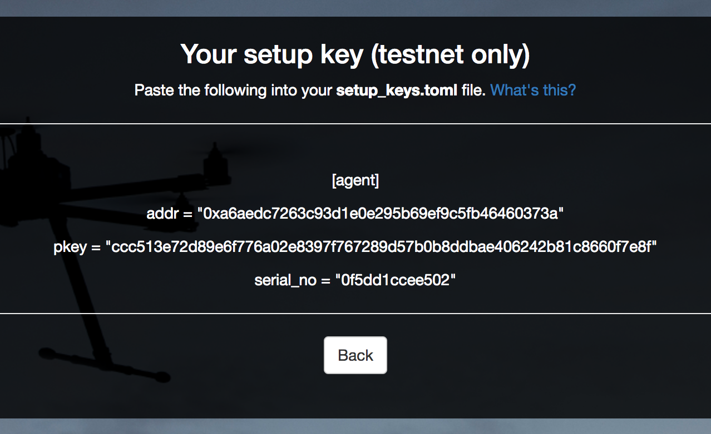
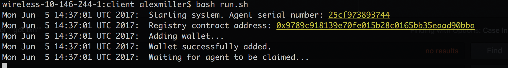
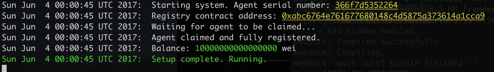
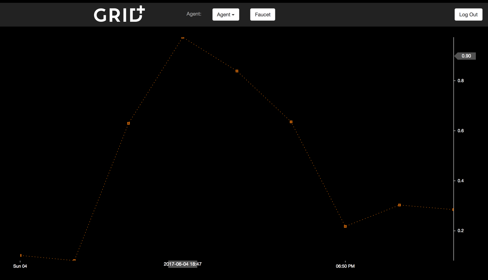

# Agent Client
This repo contains the Grid+ client, which is a binary meant to live on
the smart agent device (any small system-on-a-chip). Once the agent is registered and claimed
by a human owner, the client will receive data periodically from our hub.
Based on this data, the client may choose to reply to the hub with signed messages that move tokens
owned by the device.

## Setup

*The following is a guide to setting up your virtual device for our alpha period. This is a significantly different setup process than in our production system. Here you will need to install the client on your computer and generate a set of setup keys. In production, both the client and the keys would come pre-loaded onto your agent.*

### Prerequisites

You will need a UNIX shell (i.e. OSX or Linux). You will also need to have Go installed. If you are on OSX, you can do this with homebrew (`brew install golang`).


### 1. Switch your metamask provider

Open metamask in your browser. Our services are currently out of our own domain (this will be moved to a test network soon). You need to add `http://app.gridplus.io:8545` to your provider list. Click on the current network name next to the fox in the upper bar and click "Custom RPC"



Type in `http://app.gridplus.io:8545` and click save.




### 2. Go to app.gridplus.io

Head over to https://app.gridplus.io~ and click "Enter". This will ask you to sign a message with your private key (*not* an Ethereum transaction). Press "Sign".




### 3. Get your setup key and save it

Once you're logged in, click the button on the menu titled "Get setup key". If this doesn't do anything, try refreshing.




This should show you a setup address, private key, and serial number. **In the production app, these will be pre-loaded onto your device and the serial number will be printed on the box.**




Copy all that information and save it into the following file: `src/config/setup_keys.toml`. An example `setup_keys.toml` file looks like this:

```
[agent]
addr = "0x2a919a8ff288615fb1381ff1a582b826d412dab2"
pkey = "1aec3339a5388d3c165f7d0dd35e5c16acad31eb311f1526b920d410636a6028"
serial_no = "726a686c68f""
```

### 4. Install your client

The installation process first generates a setup key. This setup key must be registered with the Grid+ registry contract (which is not yet available to the public). To generate your setup key and build your binaries, run:

```
bash install.sh
```

This will install the prerequisites (via `go get`) and then it will generate a
private key for your simulated device and put it in the proper config file.

Now you can run the agent:
```
bash run.sh
```

This will generate a wallet key and register that with the smart contract. All subsequent blockchain interactions coming from the agent will use the wallet key instead of the setup key.

You should see something like this:


### 5. Claim ownership of your agent

Now go back to the web app and register your serial number on Ethereum. This associates your metamask address with the device's address on the blockchain.


You should see the green line in your console within a few seconds. Your device may also call the faucet for some ether. This is also normal.



Once that's complete, you can proceed to getting started with Grid+. Click "next" enter the serial number again, this time with a nickname for your device (you can call it anything).


### 6. Look at your usage data

You should now see a chart of your usage data. If you don't see anything, just wait a minute or two and refresh.



**Note: For the demo, this is randomly generated data, but in the production app you would see how much energy you are consuming and how much it is costing you.**


### Troubleshooting
Here are some common issues and solutions. Note that errors are, by default, logged to `src/agent.log`.

#### "Serial number not registered with Grid+"

You need to register your agent (with its setup key) via our demo web portal. *NOTE: This is not yet possible. Coming soon.*

#### install.sh fails to fetch packages
This is likely an issue with fetching go-ethereum. OSX and Ubuntu 16.04 should be fine, but we have run into issues with Ubuntu 14.04. If you have a problem on another OS, please let us know.

#### "Waiting for agent to be claimed..." continues forever
It is waiting for you to claim it. You may do so on our web portal. *NOTE: This is not yet possible. Coming soon.*

#### getsockopt: connection refused
You cannot hit the RPC provider.
